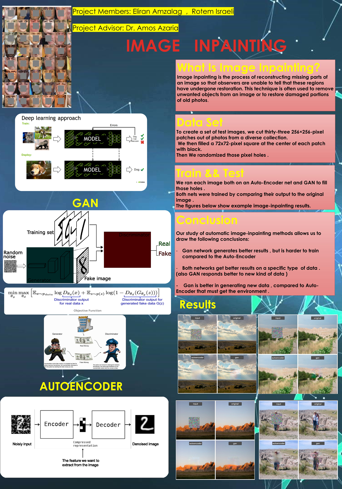
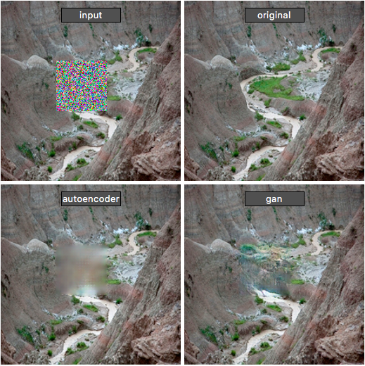

# Image-Inpainting-with-Deep-Learning-
CS final project ofI mage-Inpainting 
Image inpainting, the task of filling in holes in an image. 
In this video you can see how autoencoder and gan try to guess the missing hole in the image.
GAN vs Auto-Encoder , using PyTorch

